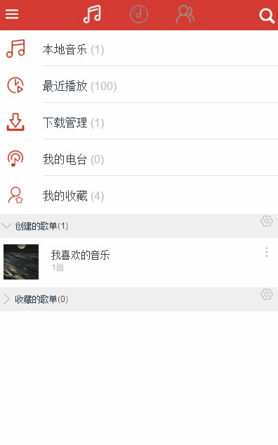

# vuejs仿网易云音乐web app

## 运行

- 

## 技术栈

 - vue+vue-router+vuex（核心框架）
 - [better-scroll](https://github.com/ustbhuangyi/better-scroll)（使移动端滑动体验更加流畅）
 - [vue-lazyload](https://www.npmjs.com/package/vue-lazyload)（用户图片懒加载）
 - [nprogress](https://www.npmjs.com/package/nprogress)（用于加载过渡）
 - [ axios](https://www.npmjs.com/package/axios)（请求）

## 功能分析与设计
用到了这里写的[API](https://github.com/zvenshy/venmusic)

## 页面展示

